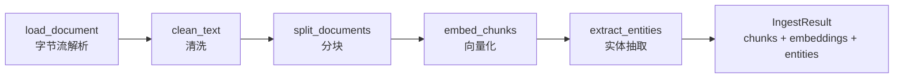

# 预处理模块使用说明（core/preprocessing.py）

## 1. 模块概述

`core/preprocessing.py` 是 Agentic RAG 诊断链路的**数据入口层**，负责把原始运维文档转化为可供检索与图谱构建使用的结构化产物。处理流水线共五步：



- 支持格式：`pdf`（pypdf）、`md`（UTF-8 解码）、`docx`（python-docx）。
- **零磁盘约束**：所有解析在 `io.BytesIO` 内存流上完成，全模块无 `open()` 写文件、无 `tempfile`、无 `Path.write_*`。
- 统一异常：底层异常一律包装为 `IngestError`（保留异常链），上层只需捕获单一类型即可降级。

## 2. 函数 API 说明

### 2.1 `load_document(file_bytes: bytes, file_type: str, filename: str) -> Document`

从字节流加载单个文档并抽取纯文本。

| 参数 | 类型 | 说明 |
| --- | --- | --- |
| `file_bytes` | `bytes` | 文档原始字节流 |
| `file_type` | `str` | `pdf` / `md` / `docx`（不区分大小写，允许前导点） |
| `filename` | `str` | 原始文件名，用于错误信息与 metadata |

- **返回**：`langchain_core.documents.Document`；metadata 至少含 `filename`、`file_type`，PDF 另含 `page_count`，MD/DOCX 另含 `paragraph_count`（按空行/段落数统计）。
- **异常**：`file_type` 不受支持时抛 `ValueError`；解析失败（损坏文档、非 UTF-8 等）抛 `IngestError`。

### 2.2 `clean_text(text: str) -> str`

清洗文本，固定顺序：`\r` 归一 → 控制字符去除（保留 `\n`）→ 中英文页眉页脚去除（`第 N 页 共 M 页` / `Page N of M`）→ 连续 3+ 换行压缩为 2 → 逐行去首尾空白。

- **返回**：清洗后文本。
- **异常**：`text` 非字符串时由 `str.replace` 自然抛 `TypeError`（不包装）。

### 2.3 `split_documents(docs: list[Document]) -> list[Document]`

按配置切分文档，分隔符优先级 `["\n\n", "\n", "。", ".", " ", ""]`。

- **返回**：分块列表；每块 metadata 在原 metadata 基础上追加 `chunk_index`（全局从 0 连续）与 `chunk_id`（uuid4 字符串，仅作数据标识）。
- **异常**：splitter 底层异常（如 `CHUNK_OVERLAP >= CHUNK_SIZE`）不在此包装，由 `ingest_documents` 统一收口为 `IngestError`。

### 2.4 `embed_chunks(chunks: list[Document]) -> np.ndarray`

将分块文本批量编码并 L2 归一化。模型经 `_get_embedder()`（`lru_cache` 进程内单例）加载，**同一模型进程内只加载一次**。

- **返回**：`float32` 二维数组 `shape=(len(chunks), embedding_dim)`；空输入返回 `shape=(0, 0)`。
- **异常**：模型加载/编码失败抛 `IngestError`。

### 2.5 `extract_entities(chunks: list[Document]) -> list[dict]`

逐分块调用 DeepSeek（`json_object` 响应格式）抽取运维实体与关系；外层按 `ENTITY_BATCH_SIZE=5` 分批迭代。

- **返回**：记录列表。实体形如 `{"source_chunk_id", "name", "type", "kind": "entity"}`；关系形如 `{"source_chunk_id", "source", "target", "type", "kind": "relation"}`。
- **异常**：LLM 调用失败或返回内容无法通过 pydantic 校验时抛 `IngestError`。

### 2.6 `ingest_documents(files: list[tuple[bytes, str, str]]) -> IngestResult`

主入口，串联上述五步：加载与清洗 → 分块 → 向量化 → 实体抽取。

- **参数**：`files` 为 `(file_bytes, file_type, filename)` 三元组列表。
- **返回**：`IngestResult`（dataclass，字段 `chunks: list[Document]`、`embeddings: np.ndarray`、`entities: list[dict]`）。
- **异常**：任一阶段失败抛 `IngestError`（原始异常保留在 `__cause__`）。

辅助类型：`EntityItem` / `RelationItem` / `ExtractionPayload`（pydantic 校验模型）、`IngestError`（统一异常）。

## 3. 使用示例

```python
from core.preprocessing import ingest_documents

files = [
    (open_bytes_from_upload("manual.pdf"), "pdf", "manual.pdf"),   # 上传接口直接给字节流
    (md_bytes_in_memory, "md", "runbook.md"),
    (docx_bytes_in_memory, "docx", "report.docx"),
]

result = ingest_documents(files)

for chunk in result.chunks:                 # 1. 分块 → 送入向量库 / BM25
    print(chunk.metadata["chunk_id"], len(chunk.page_content))

vectors = result.embeddings                 # 2. float32 矩阵 → FAISS 索引
records = result.entities                   # 3. 实体关系 → NetworkX 图谱
```

单元测试（不触发真实模型与 LLM）：

```bash
cd agentic-rag-ops
python -m pytest tests/test_preprocessing.py -p no:cacheprovider -q
```

## 4. 零磁盘约束说明

- 解析全程使用 `io.BytesIO`，**无任何文件读写**；FastAPI 上传接口应直接传 `UploadFile` 的字节流，禁止中间落盘。
- pytest 运行使用 `-p no:cacheprovider`，避免生成 `.pytest_cache`。
- ⚠️ **已知例外（环境层，非代码层）**：首次调用 `embed_chunks` 时，`sentence-transformers` 会把 `BAAI/bge-m3` 权重（约 2.2GB）下载到 `%USERPROFILE%\.cache\huggingface`（C 盘）。本项目 C 盘硬约束（增量 > 4GB 立即暂停禀报）下，建议：
  1. 预先将模型缓存离线准备好；
  2. 或设置 `HF_HOME` / `SENTENCE_TRANSFORMERS_HOME` 指向 D 盘目录后再首次运行；
  3. 后续 `bge-reranker-v2-m3`（约 2.2GB）同理，两项叠加会逼近 4.5GB，**必须**提前处理。

## 5. 配置项说明

配置经 `src/settings.py` 的 `pydantic-settings` 加载（环境变量 > `.env` > 默认值），本模块消费以下字段：

| 配置项 | 默认值 | 说明 |
| --- | --- | --- |
| `CHUNK_SIZE` | `512` | 分块最大字符数 |
| `CHUNK_OVERLAP` | `50` | 相邻分块重叠字符数（须小于 `CHUNK_SIZE`） |
| `EMBEDDING_MODEL_NAME` | `BAAI/bge-m3` | 向量化模型（首次加载有下载开销，见第 4 节） |
| `DEEPSEEK_MODEL_NAME` | `deepseek-flash` | 实体抽取 LLM |
| `DEEPSEEK_BASE_URL` | `https://api.deepseek.com` | DeepSeek 服务地址 |
| `DEEPSEEK_API_KEY` | 环境变量注入 | 平台侧已预配置，禁止硬编码 |

模块内常量：

| 常量 | 值 | 说明 |
| --- | --- | --- |
| `ENTITY_BATCH_SIZE` | `5` | 实体抽取的分批迭代粒度 |
| `SPLIT_SEPARATORS` | `["\n\n", "\n", "。", ".", " ", ""]` | 中文标点优先的分隔符优先级 |

---

> 维护约定：本模块新增/修改公开函数时，须同步更新本文档第 2 节与 `tests/test_preprocessing.py`。
